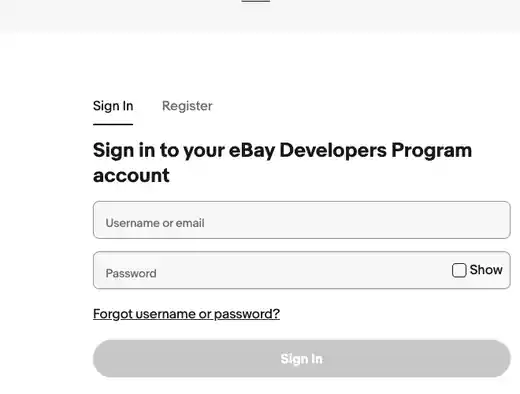
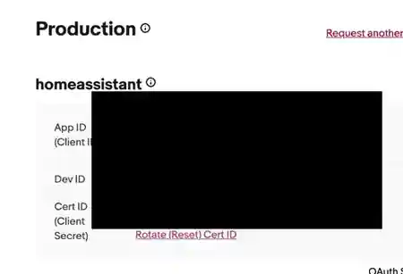
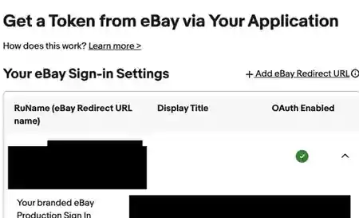
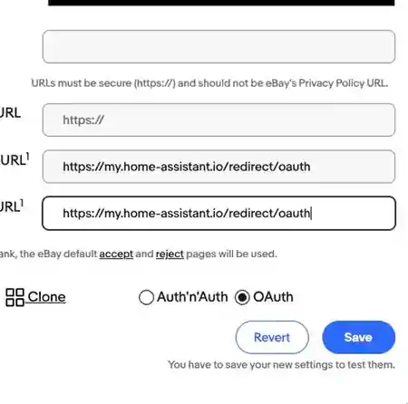
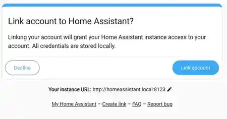

# eBay OAuth Setup Guide

This guide walks through connecting the unofficial eBay integration to Home
Assistant using eBay's OAuth authorization flow.

The eBay Developer Program and the regular eBay marketplace use separate
sign-in contexts. Your developer account owns the application credentials.
Later, the regular eBay buyer or seller account you want to monitor grants
read-only access to that application.

> [!NOTE]
> eBay may change the layout of its developer portal. Follow the field names in
> this guide even if the surrounding page looks slightly different.

## Before you begin

You need:

- Home Assistant `2026.3.0` or newer
- the eBay custom integration installed through HACS
- an eBay Developers Program account
- a regular eBay account whose activity you want to monitor

Most users should use **Production**. Use **Sandbox** only when working with
eBay test accounts and test data.

## Field reference

| Home Assistant field | eBay label | What it is |
| --- | --- | --- |
| eBay environment | Production or Sandbox | Must match the selected eBay keyset |
| App ID / Client ID | App ID (Client ID) | Public application identifier |
| Cert ID / Client secret | Cert ID (Client Secret) | Secret belonging to the same keyset |
| RuName | RuName (eBay Redirect URL name) | Identifier generated for the redirect configuration |
| eBay Site ID | Site ID | Use `0` for eBay United States |
| Callback URL | Your auth accepted/declined URL | Browser return URL supplied by Home Assistant |

## 1. Start setup in Home Assistant

1. Go to **Settings → Devices & services**.
2. Select **Add integration** and search for **eBay**.
3. Choose **Automatic callback — Recommended**.
4. Leave the setup window open.
5. Copy the OAuth callback URL displayed by Home Assistant.

You will paste that exact callback URL into the eBay developer portal. Do not
substitute your Home Assistant local URL or external URL.

## 2. Sign in to the eBay Developers Program

Open the application keys page:

```text
https://developer.ebay.com/my/keys
```

Sign in with your eBay Developers Program account. Register for the program
first if you do not already have an account.



This developer account can be different from the regular eBay account you will
authorize later.

## 3. Create or open an application keyset

Create an application if needed, or open the application you want Home
Assistant to use.

On the **Application Keys** page, select the environment you chose in Home
Assistant:

- **Production** for your real eBay account and live marketplace data
- **Sandbox** for eBay test accounts and test data



Copy these two values from the same keyset:

- **App ID (Client ID)**
- **Cert ID (Client Secret)**

Home Assistant does not use the **Dev ID**.

> [!WARNING]
> Do not mix Production credentials with the Sandbox environment, or Sandbox
> credentials with the Production environment.

## 4. Open the eBay sign-in settings

On the same application keys page, find:

```text
Get a Token from eBay via Your Application
```

Under **Your eBay Sign-in Settings**, select **Add eBay Redirect URL** or expand
an existing redirect configuration.



Use these settings:

- Select **OAuth**, not **Auth'n'Auth**.
- Set **Display Title** to a recognizable name such as `Home Assistant`.
- If eBay requests a privacy-policy URL, a personal self-hosted installation
  may use:

```text
https://github.com/andrewtryder/ha-ebay/blob/main/PRIVACY.md
```

Use your own privacy-policy URL if you deploy the integration as part of another
service or under different terms.

The **Display Title** is only a label. It is not the RuName and it is not the
callback URL.

## 5. Register the Home Assistant callback URL

Paste the callback URL from Home Assistant into both fields:

- **Your auth accepted URL**
- **Your auth declined URL**



The screenshot shows a common Home Assistant callback URL. Always use the exact
value shown by your Home Assistant setup flow.

Select **Save**. eBay then assigns a **RuName** to this redirect configuration.
Copy the generated RuName; it normally appears as a long hyphenated identifier.

The three values are different:

- **Display Title**: a human-readable label
- **Callback URL**: the URL supplied by Home Assistant
- **RuName**: the identifier generated by eBay after the redirect is saved

The callback is used only during authorization and reauthorization. Normal
operation does not require SSH, a tunnel, port forwarding, or public inbound
access to Home Assistant.

## 6. Enter the application credentials in Home Assistant

Return to the Home Assistant setup window and enter:

| Home Assistant field | Value |
| --- | --- |
| eBay environment | The environment selected on the eBay keys page |
| App ID / Client ID | The App ID from that environment's keyset |
| Cert ID / Client secret | The Cert ID from the same keyset |
| RuName | The generated eBay Redirect URL name |
| eBay Site ID | `0` for eBay United States |

Continue after checking that all three eBay identifiers came from the same
Production or Sandbox configuration.

## 7. Authorize the regular eBay account

Home Assistant opens eBay's authorization page. Sign in with the regular eBay
account whose buying, watching, bidding, or selling activity you want to
monitor, then approve the requested read-only access.

This account can be different from the eBay Developers Program account used to
create the application.

> [!IMPORTANT]
> Do not use the **Sign in to Production** button under **Get a User Token
> Here** in the developer portal. That creates a developer test token and is not
> the Home Assistant authorization flow.

## 8. Link the browser back to Home Assistant

After eBay authorization, the browser may display the Home Assistant linking
page.



Confirm that the displayed instance is the Home Assistant installation you
intend to use, then select **Link account**. Home Assistant completes the token
exchange and creates the integration entry.

## Multiple eBay accounts

A configuration is unique by environment and Client ID. Only one eBay account
can therefore be configured for a given developer application credential set.

To monitor another eBay account, create a separate eBay developer application
and configure it with a different Client ID.

## Manual authorization fallback

Use **Manual authorization — Advanced troubleshooting** only when the automatic
browser callback does not complete.

1. Restart the eBay setup flow and select the manual option.
2. Open the consent URL shown by Home Assistant.
3. Sign in with the regular eBay account you want to monitor.
4. Approve the read-only access request.
5. Paste the complete final callback URL into Home Assistant.

Pasting the complete callback URL allows Home Assistant to verify the OAuth
state. Paste only the authorization code when the full callback URL is not
available.

## Troubleshooting

| Symptom | Check |
| --- | --- |
| eBay rejects the redirect | Both accepted and declined URLs must exactly match the callback URL shown by Home Assistant |
| Authorization reports an invalid redirect or RuName | Enter the generated RuName, not the Display Title or callback URL |
| OAuth or API calls fail immediately | Confirm that the selected environment matches the Production or Sandbox keyset |
| Setup used a token copied from the developer portal | Restart setup and authorize from Home Assistant instead |
| US account data is missing or incorrect | Confirm that Site ID is `0` |
| Sell Analytics views are unavailable | Reauthorize with the analytics read-only scope, or disable analytics in the integration options |
| Browser does not return to Home Assistant | Use the manual authorization fallback and paste the complete final callback URL |

## Security notes

Treat the Cert ID/client secret, access tokens, refresh tokens, authorization
codes, and OAuth state values as confidential.

The screenshots in this guide are cropped and redacted. Do not publish your own
screenshots until all application identifiers, account names, email addresses,
tokens, codes, and personal Home Assistant URLs have been removed.
